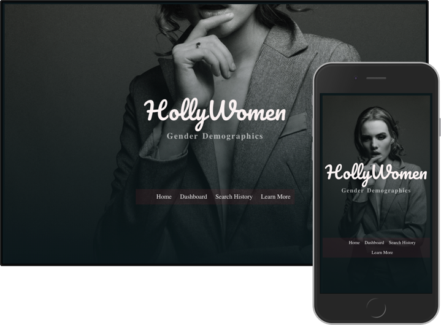

# About HollyWomen

HollyWomen, at it's core, is a demographics calculator. It is an app that allows users to see how many women, in direct comparison to men, were cast in their favorite films or TV shows. HollyWomen is designed to inform users on the gender inclusivity of a specific film or tv project. A user may search film and TV titles, with an aditional option to save them to a 'Must Watch' or 'Don't Watch' list. Use HollyWomen to the gather simple demographics for educational purposes only. 

## Link To Live Site: 
- https://hollywomen.herokuapp.com/

## Features:

- Landing page for user onboarding that includes information on what HollyWomen is, why the app was created, and how to use it. 
- Input box for a user to enter their search term
- Drop down options menu to select whether the user is searching TV or Movies
- Full rendering of clickable poster images -- each one corresponding to all possibilities/matches from the user search term
- Results Modal that displays the results (and possible a snarky comment...) 
- When a user searches either TV or Movies, we've created endpoints to directly access the https://www.themoviedb.org API 
- Nav bar with links to 'Most searched terms'
- Link to a separate page for 'MOST SEARCHED TERMS', a calculated list of the user's most frequent searched terms 
- Mobile-first design
- A11y friendly

## Tech-Stack
**Back-end:**
https://github.com/thinkful-ei26/jordan-hollywomen-server
- Node
- MongoDB 
- Mongoose

**Front-end:**
- React 
- Redux for state management

**Dev:**
- Git/Github
- Heroku
- TravisCI

## API:
```
/api
.
├── /search
│   └── GET
│       ├── /:movieTitle  <- GET movie info
│       └── /:tvTitle <- GET tv info
├── /movie
│   └── GET
│       └── /:id <- GET movie cast info
├── /tv
│   └── GET
│       ├── /:id <- GET TV cast info
```

## Screenshot:

